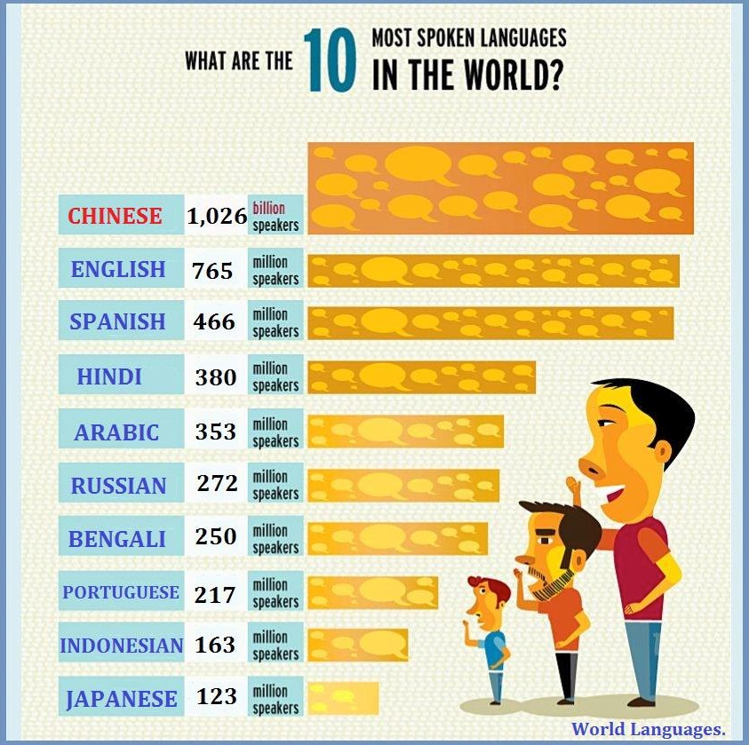
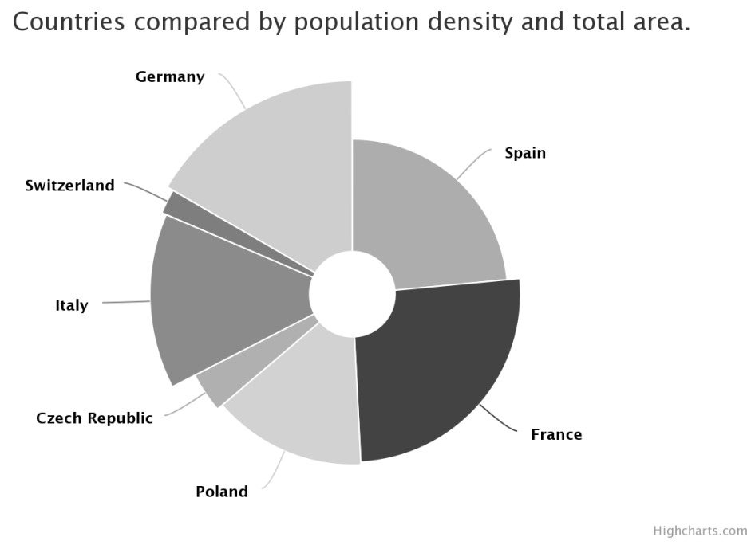
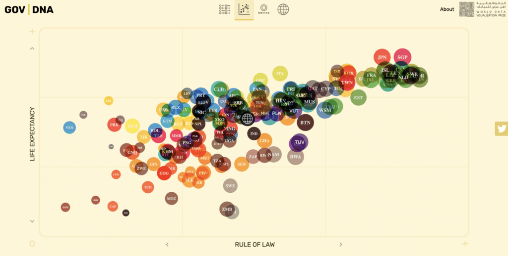

### Load packages

```{r load-packages, message = FALSE, warning=FALSE}
library(tidyverse)
library(ggplot2)
```


# Questioning data visualisations

## Image 1

```{r echo=FALSE, out.width="100%"}

```

_Write your comments about image 1 below_
The bars are not in proportion to the largest spoken language statistic, i.e, English numbers of speakers is represented as close to Chinese. Graphic is also unnecessary. 


## Image 2

```{r echo=FALSE, out.width="100%"}

```

_Write your comments about image 2 below_
I don't even know what the pie chart is trying to depict. No numbers are shown. It's also really hard to compare the shapes.


## Image 3

```{r echo=FALSE, out.width="100%"}

```

_Write your comments about image 3 below_
Can't read the country names, no title, no y-axis. 


## Image 4

```{r echo=FALSE, out.width="100%"}
knitr::include_graphics("img/global-income-dist.png")
```

_Write your comments about image 4 below_
Scale is not consistent, the distribution of population are stacked ontop of one another, it reads hard.


# Exercises

```{r load-data-staff, message=FALSE, eval=TRUE}
staff <- read_csv("data/instructional-staff.csv")
```


## Exercise 1

What is the difference between *wide format* data and *long format* data?
In wide format, x-axis is the independent variable, whilst in long format, y-axis is the independent variable.

Is the format `staff` data *wide* or *long*?
Wide format

How many observations are there in the data set?
11 observations.


## Exercise 2

```{r pivoting}
## Uncomment and complete the following code

staff_long <- staff %>%
  pivot_longer(
    cols = "1975":"2011", 
    names_to = "year",
    values_to = "percent"
    )

```


## Exercise 3

```{r dot-plot}
# Write your code for Exercise 3 here
ggplot(data = staff_long,
       mapping = aes(x = year,
                     y = percent,
                     colour = faculty_type)) + 
  geom_point()


```

## Exercise 4

```{r bad-line-plot}
# Write your code for Exercise 4 here
ggplot(data = staff_long,
       mapping = aes(x = year,
                     y = percent,
                     colour = faculty_type)) + 
  geom_point() +
  geom_line()
```

## Exercise 5

```{r mutate-year}
## Uncomment and complete the following code

staff_long <- staff_long %>%
  mutate(year = as.numeric(year))
```


```{r working-line-plot}
# Write your code for Exercise 5 here
ggplot(data = staff_long,
       mapping = aes(x = year,
                     y = percent,
                     colour = faculty_type)) + 
  geom_point() +
  geom_line()


```

## Exercise 6

```{r better-line-plot}
# Write your code for Exercise 6 here
ggplot(data = staff_long,
       mapping = aes(x = year,
                     y = percent,
                     colour = faculty_type)) + 
  geom_point() +
  geom_line() + 
  labs(color = "Faculty Type", x = "Year", y = "Percentage (%)") +
  ggtitle("Faculty Type in ___", "1975-2011")


```

## Exercise 7

_Write below your ideas for adapting the line plot_

* Idea 1
* Idea 2
* Idea 3
* ...


## Exercise 8

```{r implement-Ex7}
# Write your code for Exercise 8 here


```

